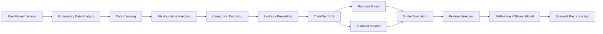

<div align="center">


<br />
An end-to-end healthcare machine learning project for exploring clinical, demographic, lifestyle, and healthcare-access factors associated with colorectal cancer survival.
The project combines exploratory data analysis, preprocessing, feature selection, model comparison, class-imbalance handling, interpretability, and a Streamlit application that produces survival probabilities and risk categories from patient inputs.
<p align="center">
  
</p>
</div>
---
🧬 Project Overview
Colorectal cancer survival can be influenced by a complex interaction of clinical characteristics, demographic factors, lifestyle behaviors, and access to healthcare. This project applies supervised machine learning to examine those relationships and predict whether a patient is likely to survive.
The workflow was designed around two goals:
Predictive modeling — compare classification models and identify an effective approach for survival prediction.
Interpretability — examine which patient characteristics contribute most strongly to the model's decisions.
The final application uses a reduced-feature XGBoost classifier and presents the prediction as a survival probability, mortality probability, and risk category.
> [!IMPORTANT]
> This repository is an academic machine learning demonstration. It is **not a medical device**, has not been clinically validated, and must not be used to diagnose patients or guide real-world treatment decisions.
---
🎯 Objectives
Clean and prepare a large retrospective colorectal cancer dataset.
Explore survival patterns across demographic, clinical, and lifestyle variables.
Prevent target leakage by removing post-outcome and identifier fields.
Compare Random Forest and XGBoost classification approaches.
Address class imbalance and prioritize recall for the survival class.
Identify influential predictors using feature-importance analysis.
Deploy the selected model through an interactive Streamlit interface.
---
📊 Dataset
The analysis uses a retrospective dataset containing:
Dataset Property	Value
Patient records	89,945
Original variables	30
Target variable	`Survival_Status`
Problem type	Binary classification
Train/test split	80% / 20%
Feature groups
Category	Example variables
Demographic	Age, gender, socioeconomic status, urban/rural residence
Clinical	Stage at diagnosis, tumor aggressiveness, previous cancer history
Lifestyle	BMI, physical activity, smoking, alcohol use, diet, red-meat and fiber consumption
Healthcare access	Insurance coverage, colonoscopy access, treatment access, time to diagnosis
Treatment	Chemotherapy, radiotherapy, and surgery received
The prediction target indicates whether the patient survived or did not survive by the end of the recorded follow-up period.
---
🔬 Machine Learning Workflow

1. Exploratory Data Analysis
The analysis investigates:
Numerical feature distributions
Categorical class distributions
Survival-class balance
Age and BMI patterns by survival outcome
Cancer stage and survival relationships
Correlations across encoded variables
2. Data Preprocessing
The preprocessing workflow includes:
Median imputation for numerical values
Most-frequent imputation for categorical values
Label encoding of categorical variables
Outlier capping using the interquartile range method
Feature scaling with `StandardScaler`
Principal component analysis during Random Forest experimentation
Explicit separation of predictors and the target variable
Leakage and bias controls
The project excludes fields that should not be used as predictors, including:
`Patient_ID` — identifier rather than a predictive feature
`Recurrence` and `Time_to_Recurrence` — potential target leakage
`Follow_Up_Adherence` — post-treatment information
`Survival_Status` — prediction target
Race and region fields during the later modeling workflow to reduce potential bias concerns
3. Model Development
Models evaluated in the project include:
Random Forest with the full feature set
XGBoost with 23 features
XGBoost with 15 features
XGBoost with 10 selected features
Class weighting through XGBoost's `scale_pos_weight` parameter was used to improve sensitivity to the minority outcome.
---
📈 Model Evaluation
Models were compared using:
Accuracy
Precision
Recall
F1-score
ROC-AUC
Confusion matrix
Model	Accuracy	Recall — Survived	ROC-AUC	Observation
Random Forest — 23 features	0.75	1.00*	0.50	Collapsed toward one-class predictions
XGBoost — 23 features	0.54	0.42	0.49	Weak overall separation
XGBoost — 15 features	0.53	0.43	0.49	Similar performance with fewer inputs
XGBoost — 10 features	0.52	0.45	0.50	Selected for the best recall/simplicity tradeoff
<sub>*The Random Forest recall value was misleading because the model largely predicted a single class. This illustrates why accuracy or recall should never be interpreted without reviewing the confusion matrix and class-level behavior.</sub>
Selected-model confusion matrix
Actual / Predicted	Not Survived	Survived
Not Survived	7,399	6,119
Survived	2,442	2,029
The final 10-feature XGBoost model was selected because it provided the strongest recall among the evaluated XGBoost configurations while using a smaller and more practical input set.
---
🔎 Key Predictive Factors
Feature-importance analysis identified the following variables as influential in predicting survival:
Body Mass Index (BMI)
Age
Stage at diagnosis
Physical activity level
Alcohol consumption
Tumor aggressiveness
Red-meat consumption
Smoking status
Fiber consumption
Screening regularity
BMI and age contributed the greatest relative importance in the reported model, followed by stage at diagnosis and several lifestyle-related variables.
> Feature importance describes how the trained model uses variables within this dataset. It does not establish medical causation.
---
💻 Interactive Prediction Application
The Streamlit application accepts ten patient characteristics:
Age
BMI
Stage at diagnosis
Time to diagnosis
Insurance coverage
Diet type
Physical activity level
Smoking status
Alcohol consumption
Red-meat consumption
The application returns:
A predicted survival outcome
Estimated survival probability
Estimated mortality probability
A visual probability comparison
A risk category based on the predicted survival probability
Risk categories
Category	Predicted survival probability
🟢 Low risk	Greater than 70%
🟡 Moderate risk	40%–70%
🔴 High risk	Less than 40%
---
🗂️ Repository Structure
```text
Colon-Cancer-Survival-Prediction/
│
├── Presentation - Predicting Colorectal Cancer Survival.pptx
├── main (1).py                 # EDA, preprocessing, Random Forest, feature analysis
├── app (1).py                  # Portable Streamlit application
├── app (2).py                  # Local-path Streamlit application variant
├── xgb_11.pkl                  # Serialized final XGBoost model
├── features_11.pkl             # Ordered model feature list
└── README.md
```
> The training script expects `colorectal_cancer_prediction.csv`. Add the dataset to the project directory before running the full analysis workflow.
---
🛠️ Technologies Used
Technology	Purpose
Python	Core programming language
Pandas	Data loading, transformation, and analysis
NumPy	Numerical operations and input-array construction
Matplotlib	Exploratory visualizations
Seaborn	Statistical charts and feature-importance plots
Scikit-learn	Preprocessing, Random Forest modeling, PCA, and evaluation
XGBoost	Final gradient-boosted classification model
Streamlit	Interactive prediction dashboard
Pickle	Model and feature-list serialization
Google Colab	Initial notebook-based development environment
---
🚀 Running the Project
1. Clone the repository
```bash
git clone https://github.com/Muhler20/Colon-Cancer-Survival-Prediction.git
cd Colon-Cancer-Survival-Prediction
```
2. Create and activate a virtual environment
Windows
```bash
python -m venv .venv
.venv\Scripts\activate
```
macOS / Linux
```bash
python3 -m venv .venv
source .venv/bin/activate
```
3. Install dependencies
```bash
pip install pandas numpy matplotlib seaborn scikit-learn xgboost streamlit
```
4. Launch the Streamlit application
Use the portable application file, which loads the serialized model from the repository directory:
```bash
streamlit run "app (1).py"
```
The application should open automatically in your browser. Otherwise, visit the local URL displayed in the terminal.
5. Run the analysis workflow
Place the dataset in the repository root using this filename:
```text
colorectal_cancer_prediction.csv
```
Then run:
```bash
python "main (1).py"
```
---
📦 Recommended `requirements.txt`
```text
matplotlib
numpy
pandas
scikit-learn
seaborn
streamlit
xgboost
```
---
⚠️ Limitations
The reported ROC-AUC values are near random-classification performance.
Class imbalance makes accuracy alone an unreliable evaluation metric.
Label encoding may impose artificial order on nominal categories.
The model has not been externally validated on an independent clinical dataset.
The dataset may contain sampling bias or synthetic patterns that do not generalize to real patients.
Risk thresholds in the application are demonstration rules rather than clinically established cutoffs.
Feature importance does not imply a causal relationship.
These limitations make the project most appropriate as a demonstration of an end-to-end healthcare machine learning workflow rather than a production clinical system.
---
🔮 Future Improvements
Use stratified cross-validation instead of a single train/test split.
Evaluate class-balanced metrics such as PR-AUC, balanced accuracy, and Matthews correlation coefficient.
Tune XGBoost hyperparameters through randomized or Bayesian search.
Compare class weighting with SMOTE and other resampling methods.
Replace basic label encoding with a reproducible preprocessing pipeline.
Add probability calibration and threshold optimization.
Incorporate SHAP explanations for patient-level interpretability.
Validate performance on an independent external dataset.
Add automated tests, a `requirements.txt`, and deployment configuration.
Rename scripts to conventional filenames such as `train_model.py` and `app.py`.
---
👥 Authors
Michael Uhler  
Suman Lamsal  
Saint Peter's University
---
📚 Research Context
The project presentation references prior work involving lifestyle-based colorectal cancer risk modeling, machine learning analysis of survival risk factors, clinical survival prediction equations, Cox regression, and random survival forests.
---
📄 License and Responsible Use
No license is currently included in the repository. Add a license before reuse or distribution.
This project is provided for education, portfolio demonstration, and academic research only. Predictions must not be interpreted as medical advice or used in real clinical decision-making.
<div align="center">
---
Built with Python, XGBoost, Scikit-learn, and Streamlit

