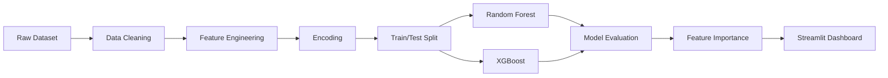

<div align="center">


[](https://python.org)
[](https://scikit-learn.org)
[
[](https://pandas.pydata.org)
[](https://streamlit.io)
[]()

<br>

### Predicting Patient Survival Using Machine Learning & Clinical Data

An end-to-end machine learning project that predicts colorectal cancer survival using demographic, clinical, and lifestyle factors. The project explores data preprocessing, feature engineering, model evaluation, explainable AI, and deployment through an interactive Streamlit application.

<br>

<p align="center">

</p>

</div>

---

# 🩺 Project Overview

Colorectal cancer remains one of the leading causes of cancer-related deaths worldwide. Accurate survival prediction enables clinicians to identify high-risk patients earlier, prioritize treatment strategies, and support evidence-based decision making.

This project develops multiple supervised machine learning models capable of predicting colorectal cancer survival from patient demographic information, clinical history, healthcare accessibility, and lifestyle behaviors.

The complete machine learning workflow includes:

- 📊 Exploratory Data Analysis (EDA)
- 🧹 Data Cleaning & Preprocessing
- 🏷️ Feature Encoding
- ⚖️ Class Imbalance Handling
- 🤖 Machine Learning Model Development
- 📈 Model Evaluation
- 🎯 Feature Importance Analysis
- 🌐 Interactive Streamlit Deployment

---

# 🎯 Objectives

The primary goals of this project were to:

- Predict patient survival outcomes using machine learning
- Compare multiple classification algorithms
- Identify the most influential predictors of survival
- Build an interactive application for real-time predictions
- Demonstrate an end-to-end healthcare data science workflow

---

# 📂 Dataset

The project utilizes a retrospective colorectal cancer dataset containing

| Metric | Value |
|---------|------:|
| Total Patients | **89,945** |
| Features | **30** |
| Target Variable | Survival Status |
| Data Type | Clinical + Demographic + Lifestyle |

The dataset contains information including:

- Age
- BMI
- Cancer Stage
- Physical Activity
- Smoking Status
- Alcohol Consumption
- Diet Type
- Treatment Access
- Insurance Coverage
- Tumor Aggressiveness
- Screening History
- Family History
- Chemotherapy
- Radiotherapy
- Surgery
- Socioeconomic Status

---

# ⚙️ Machine Learning Pipeline



---

# 🔬 Data Preprocessing

To improve model quality and eliminate potential sources of bias, several preprocessing techniques were performed.

## ✔ Feature Engineering

- Label Encoding for categorical variables
- Feature selection
- Removal of identifier columns
- Removal of target leakage variables
- Feature scaling where appropriate

## ✔ Data Cleaning

- Removed Patient_ID
- Removed post-treatment variables
- Eliminated target leakage features
- Standardized categorical values

## ✔ Dataset Split

```text
Training Set : 80%

Testing Set : 20%
```

---

# 🤖 Models Evaluated

The following supervised learning models were implemented and compared.

| Model | Purpose |
|--------|----------|
| 🌲 Random Forest | Baseline ensemble classifier |
| ⚡ XGBoost (23 Features) | Gradient boosting benchmark |
| ⚡ XGBoost (15 Features) | Reduced feature experiment |
| ⚡ XGBoost (10 Features) | Final production model |
