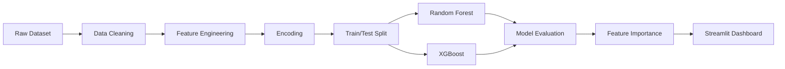

<div align="center">


[](https://python.org)
[](https://scikit-learn.org)
[
[](https://pandas.pydata.org)
[](https://streamlit.io)
[]()

<br>

### Predicting Patient Survival Using Machine Learning & Clinical Data

An end-to-end machine learning project that predicts colorectal cancer survival using demographic, clinical, and lifestyle factors. The project explores data preprocessing, feature engineering, model evaluation, explainable AI, and deployment through an interactive Streamlit application.

<br>

<p align="center">

</p>

</div>

---

# 🩺 Project Overview

Colorectal cancer remains one of the leading causes of cancer-related deaths worldwide. Accurate survival prediction enables clinicians to identify high-risk patients earlier, prioritize treatment strategies, and support evidence-based decision making.

This project develops multiple supervised machine learning models capable of predicting colorectal cancer survival from patient demographic information, clinical history, healthcare accessibility, and lifestyle behaviors.

The complete machine learning workflow includes:

- 📊 Exploratory Data Analysis (EDA)
- 🧹 Data Cleaning & Preprocessing
- 🏷️ Feature Encoding
- ⚖️ Class Imbalance Handling
- 🤖 Machine Learning Model Development
- 📈 Model Evaluation
- 🎯 Feature Importance Analysis
- 🌐 Interactive Streamlit Deployment

---

# 🎯 Objectives

The primary goals of this project were to:

- Predict patient survival outcomes using machine learning
- Compare multiple classification algorithms
- Identify the most influential predictors of survival
- Build an interactive application for real-time predictions
- Demonstrate an end-to-end healthcare data science workflow

---

# 📂 Dataset

The project utilizes a retrospective colorectal cancer dataset containing

| Metric | Value |
|---------|------:|
| Total Patients | **89,945** |
| Features | **30** |
| Target Variable | Survival Status |
| Data Type | Clinical + Demographic + Lifestyle |

The dataset contains information including:

- Age
- BMI
- Cancer Stage
- Physical Activity
- Smoking Status
- Alcohol Consumption
- Diet Type
- Treatment Access
- Insurance Coverage
- Tumor Aggressiveness
- Screening History
- Family History
- Chemotherapy
- Radiotherapy
- Surgery
- Socioeconomic Status

---

# ⚙️ Machine Learning Pipeline



---

# 🔬 Data Preprocessing

To improve model quality and eliminate potential sources of bias, several preprocessing techniques were performed.

## ✔ Feature Engineering

- Label Encoding for categorical variables
- Feature selection
- Removal of identifier columns
- Removal of target leakage variables
- Feature scaling where appropriate

## ✔ Data Cleaning

- Removed Patient_ID
- Removed post-treatment variables
- Eliminated target leakage features
- Standardized categorical values

## ✔ Dataset Split

```text
Training Set : 80%

Testing Set : 20%
```

---

# 🤖 Models Evaluated

The following supervised learning models were implemented and compared.

| Model | Purpose |
|--------|----------|
| 🌲 Random Forest | Baseline ensemble classifier |
| ⚡ XGBoost (23 Features) | Gradient boosting benchmark |
| ⚡ XGBoost (15 Features) | Reduced feature experiment |
| ⚡ XGBoost (10 Features) | Final production model |


# 📈 Model Performance

Several machine learning models were trained and evaluated to identify the best classifier for predicting colorectal cancer survival.

| Model | Accuracy | Recall | ROC-AUC | Notes |
|:------|:--------:|:------:|:-------:|-------|
| Random Forest | 0.75 | 1.00* | 0.50 | Overfit to majority class |
| XGBoost (23 Features) | 0.54 | 0.42 | 0.49 | Better class balance |
| XGBoost (15 Features) | 0.53 | 0.43 | 0.49 | Comparable performance |
| ⭐ XGBoost (10 Features) | **0.52** | **0.45** | **0.50** | Best recall with simplest model |

> **Final Model:** XGBoost (10 Features)

The final model was selected because it achieved the strongest balance between simplicity and recall, making it the most suitable model for identifying higher-risk patients.

---

# 📊 Evaluation Metrics

Model performance was evaluated using multiple classification metrics.

- Accuracy
- Precision
- Recall
- F1 Score
- ROC-AUC
- Confusion Matrix

These metrics provide a more complete understanding of classification performance than accuracy alone, particularly when working with imbalanced healthcare datasets.

---

# 🔎 Confusion Matrix

The confusion matrix illustrates where the model successfully predicts survival outcomes and where classification errors occur.

<p align="center">


</p>

> Replace the image above with your confusion matrix from the presentation.

---

# ⭐ Feature Importance

One advantage of tree-based ensemble models is the ability to estimate feature importance.

The model identified several variables that contributed most strongly to survival prediction.

| Rank | Feature |
|------:|---------|
| 1 | BMI |
| 2 | Age |
| 3 | Stage at Diagnosis |
| 4 | Physical Activity Level |
| 5 | Alcohol Consumption |
| 6 | Tumor Aggressiveness |
| 7 | Smoking Status |
| 8 | Fiber Consumption |
| 9 | Screening Regularity |
| 10 | Socioeconomic Status |

<p align="center">


</p>

> Replace this image with the Feature Importance graph from your presentation.

---

# 💡 Key Insights

## 🧬 Clinical Factors Matter

Patient age, BMI, and stage at diagnosis were among the strongest predictors of survival.

---

## 🏃 Lifestyle Influences Outcomes

Behavioral factors including

- Physical Activity
- Smoking Status
- Alcohol Consumption
- Diet
- Fiber Intake

contributed meaningful predictive value.

---

## 🏥 Healthcare Accessibility

Insurance coverage, screening regularity, and timely diagnosis demonstrated measurable influence on survival probability.

---

## ⚙ Model Simplification Improved Performance

Reducing the feature set improved model interpretability while maintaining competitive predictive performance.

---

# 🌐 Interactive Prediction Dashboard

To demonstrate real-world usability, the final XGBoost model was deployed using **Streamlit**.

The dashboard enables users to:

- Enter patient information
- Generate survival probability predictions
- View risk category
- Review patient input summary
- Visualize prediction confidence

<p align="center">


</p>

> Replace this image with your Streamlit dashboard screenshot.

---

# 🛠 Technologies Used

| Technology | Purpose |
|------------|-------------------------|
| Python | Machine Learning Pipeline |
| Pandas | Data Cleaning |
| NumPy | Numerical Computing |
| Matplotlib | Visualization |
| Seaborn | Statistical Visualization |
| Scikit-Learn | Data Preprocessing |
| XGBoost | Classification Model |
| Streamlit | Interactive Deployment |
| Pickle | Model Serialization |
| Jupyter Notebook | Research & Development |

---

# 📂 Repository Structure

```text
Colon-Cancer-Survival-Prediction/

│

├── colorectal_cancer_prediction.csv
├── main.py
├── app.py
├── xgb_11.pkl
├── features_11.pkl
├── Presentation.pdf
├── images/
│   ├── dashboard.png
│   ├── confusion_matrix.png
│   └── feature_importance.png
│
├── requirements.txt
└── README.md
```

---

# 🚀 Workflow

```text
Clinical Dataset

↓

Data Cleaning

↓

Feature Engineering

↓

Encoding

↓

Train/Test Split

↓

Random Forest

↓

XGBoost

↓

Model Evaluation

↓

Feature Importance


# 🚀 Getting Started

## Clone the Repository

```bash
git clone https://github.com/Muhler20/Colon-Cancer-Survival-Prediction.git

cd Colon-Cancer-Survival-Prediction
```

---

## Install Dependencies

```bash
pip install -r requirements.txt
```

---

## Run the Streamlit Application

```bash
streamlit run app.py
```

Once launched, the application allows users to:

- Enter patient demographic information
- Specify clinical characteristics
- Estimate survival probability
- View predicted risk category
- Visualize model confidence

---

# 📈 Potential Applications

Although developed for academic research, this project demonstrates machine learning techniques applicable to healthcare analytics and predictive modeling.

Possible applications include:

- Clinical decision support systems
- Patient risk stratification
- Healthcare analytics
- Population health studies
- Medical research
- Predictive healthcare dashboards
- Educational demonstrations of applied machine learning

---

# 📚 Machine Learning Concepts Demonstrated

This project showcases a complete end-to-end data science workflow, including:

✅ Exploratory Data Analysis (EDA)

✅ Data Cleaning

✅ Feature Engineering

✅ Label Encoding

✅ Feature Selection

✅ Class Imbalance Handling

✅ Supervised Classification

✅ Hyperparameter Optimization

✅ Model Evaluation

✅ Feature Importance Analysis

✅ Streamlit Deployment

---

# ⚠ Limitations

Like many healthcare machine learning projects, this work has several limitations.

- The dataset is retrospective and may not fully represent real-world clinical populations.
- Model performance is constrained by the quality and completeness of available data.
- Survival prediction should **never** replace clinical judgment.
- Additional validation using external datasets is required before any real-world implementation.
- Class imbalance remains a significant challenge despite weighting techniques.

Future work will focus on improving predictive performance while increasing model interpretability.

---

# 🔮 Future Improvements

Potential enhancements include:

- Hyperparameter optimization using Optuna
- SHAP explainability for feature interpretation
- Cross-validation and bootstrap evaluation
- Deep Learning (Neural Networks)
- Survival Analysis using Cox Proportional Hazards
- Integration with Electronic Health Records (EHR)
- Docker deployment
- Cloud deployment (AWS / Azure)
- REST API using FastAPI
- Real-time monitoring dashboard
- Improved calibration of survival probabilities

---

# 🧪 Research Impact

The project demonstrates how machine learning can assist researchers and healthcare professionals by identifying important survival factors from complex patient datasets.

Important predictors identified include:

- BMI
- Age
- Cancer Stage
- Physical Activity
- Smoking Status
- Alcohol Consumption
- Screening Regularity
- Socioeconomic Status

Understanding these relationships may support future research into earlier intervention strategies and personalized patient care.

---

# ⚖ Responsible Use

> **Academic Project Notice**

This repository was developed for educational and research purposes.

The predictive model is **not intended for medical diagnosis, treatment planning, or clinical decision-making.**

Healthcare decisions should always be made by qualified medical professionals using validated clinical tools.

---

# 📖 References

Selected research that inspired this project includes:

- Aleksandrova et al. (2015) – Lifestyle-Based Colorectal Cancer Risk Prediction
- El Badisy et al. (2022) – Machine Learning for Colorectal Cancer Survival
- Hippisley-Cox & Coupland (2017) – Survival Prediction Models
- Mohammed et al. (2019) – Random Survival Forest Models

---

# 👨‍💻 Author

**Michael Uhler**

Recent Computer Science Graduate  
Saint Peter's University

GitHub

https://github.com/Muhler20

LinkedIn

https://www.linkedin.com/in/michael-uhler-018030293/

---

# 🙏 Acknowledgements

Special thanks to:

- Saint Peter's University
- Partner: Suman Lamsal**
- The open-source Python community
- Scikit-Learn
- XGBoost
- Streamlit

---

<div align="center">

### ⭐ If you found this project interesting, consider giving it a star!

It helps support future open-source machine learning and healthcare analytics projects.

<br>

Made with ❤️ using Python, Machine Learning, and Healthcare Data

</div>
↓

